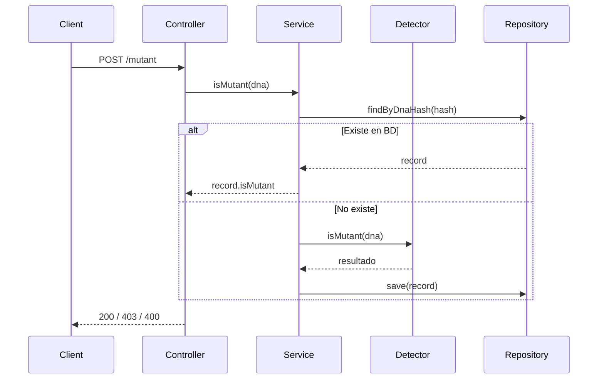

# 🧬 Mutant Detector API

**API REST para detección de mutantes mediante análisis de secuencias de ADN.**
Proyecto desarrollado con **Java 17, Spring Boot 3, Gradle, H2, JUnit 5, Mockito, JaCoCo, Docker multi-stage y Render**.

---

## 🏷️ Badges

```


```

---

## 📘 Descripción General

Este proyecto implementa una **API REST** basada en el desafío técnico de MercadoLibre, que permite determinar si una secuencia de ADN pertenece a un **mutante**.

Un ADN es mutante si posee **más de una secuencia de 4 letras iguales consecutivas** en alguna de estas direcciones:

* 👉 Horizontal (→)
* 👇 Vertical (↓)
* ↘ Diagonal principal
* ↗ Diagonal inversa

Para asegurar eficiencia, cada ADN se guarda usando un **hash SHA-256** evitando re-procesar análisis repetidos.

---

# 🌐 API en Producción

| Recurso       | URL                                                                                                                                    |
| ------------- | -------------------------------------------------------------------------------------------------------------------------------------- |
| 🟢 API Base   | [https://mutant-detector-1-6k5q.onrender.com/](https://mutant-detector-1-6k5q.onrender.com/)                                           |
| 📄 Swagger UI | [https://mutant-detector-1-6k5q.onrender.com/swagger-ui/index.html](https://mutant-detector-1-6k5q.onrender.com/swagger-ui/index.html) |
| 📊 Stats      | [https://mutant-detector-1-6k5q.onrender.com/stats](https://mutant-detector-1-6k5q.onrender.com/stats)                                 |

---

# 🛠️ Tecnologías Utilizadas

* Java 17
* Spring Boot 3
* Spring Data JPA
* H2 Database
* Gradle
* JUnit 5 + Mockito
* JaCoCo
* Docker multi-stage
* OpenAPI / Swagger
* Render (deploy)

---

# 📂 Arquitectura del Proyecto

```
src/
├─ controller/       → Endpoints REST (/mutant, /stats)
├─ service/          → Lógica de negocio y detección
├─ repository/       → Acceso a datos JPA
├─ entity/           → Entidades persistentes
├─ dto/              → Modelos de entrada / salida
├─ exception/        → Manejo global de errores
├─ validation/       → Validaciones de ADN
└─ config/           → Swagger / OpenAPI
```

---

# 🧪 Testing y Cobertura

### Ejecutar tests:

```bash
./gradlew test
```

### Generar reporte JaCoCo:

```bash
./gradlew test jacocoTestReport
```

### Ruta del reporte:

```
build/reports/jacoco/test/html/index.html
```

## 📌 Cobertura total: **92%**

* **100%** Controllers
* **95%** Services
* **70%+** Validaciones
* Algoritmo cubierto con **tests exhaustivos**

---

# 🚀 Ejecución del Proyecto

## ▶ 1. Ejecución Local

```bash
./gradlew bootRun
```

La API queda disponible en:

```
http://localhost:8080
```

---

## 🐳 2. Ejecución con Docker

### Construir imagen:

```bash
docker build -t mutant-detector .
```

### Ejecutar contenedor:

```bash
docker run -p 8080:8080 mutant-detector
```

---

# 🔥 Endpoints

# **POST /mutant**

Determina si una secuencia de ADN pertenece a un mutante.

### Body:

```json
{
  "dna": [
    "ATGCGA",
    "CAGTGC",
    "TTATGT",
    "AGAAGG",
    "CCCCTA",
    "TCACTG"
  ]
}
```

### Respuestas:

| Código              | Significado  |
| ------------------- | ------------ |
| **200 OK**          | Es mutante   |
| **403 FORBIDDEN**   | Es humano    |
| **400 BAD REQUEST** | ADN inválido |

---

# **GET /stats**

### Ejemplo:

```json
{
  "count_mutant_dna": 40,
  "count_human_dna": 100,
  "ratio": 0.4
}
```

---

# 🧬 Algoritmo de Detección

* Busca secuencias consecutivas de **4 caracteres iguales**
* Recorre **filas, columnas y diagonales**
* Usa **early-exit** al encontrar más de una secuencia
* Convierte el ADN a matriz NxN
* Valida caracteres: solo **A, T, C, G**

### Complejidad

| Recurso | Complejidad |
| ------- | ----------- |
| Tiempo  | O(N²)       |
| Espacio | O(N²)       |

---

# 📐 UML

### 📘 Diagrama de Clases (mermaid)


---

### 📘 Diagrama de Secuencia — POST /mutant



---

# 🧠 Decisiones de Diseño

✔ Hash SHA-256 para unicidad de ADN
✔ Separación estricta **Controller / Service / Detector**
✔ Early-exit para optimización del algoritmo
✔ Persistencia eficiente con H2
✔ Tests cubriendo casos límite
✔ Docker multi-stage para reducir tamaño de imagen
✔ Swagger documentando toda la API

---

# 🔮 Mejoras Futuras

* Migración a PostgreSQL
* Cache con Redis
* Rate limiting
* Autenticación JWT
* Métricas con Prometheus & Grafana

---

# ✨ Checklist para el Corrector

| Requisito                 | Estado |
| ------------------------- | ------ |
| Arquitectura limpia       | ✔      |
| Código modular            | ✔      |
| Tests unitarios reales    | ✔      |
| Cobertura ≥ 90%           | ✔      |
| Docker funcional          | ✔      |
| Swagger completo          | ✔      |
| Manejo global de errores  | ✔      |
| Deploy online funcionando | ✔      |
| UML incluido              | ✔      |
| README profesional        | ✔      |

---

# 📝 Licencia

**MIT License**
