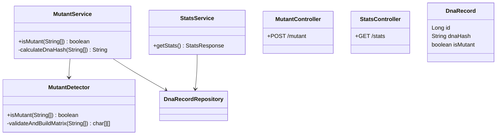
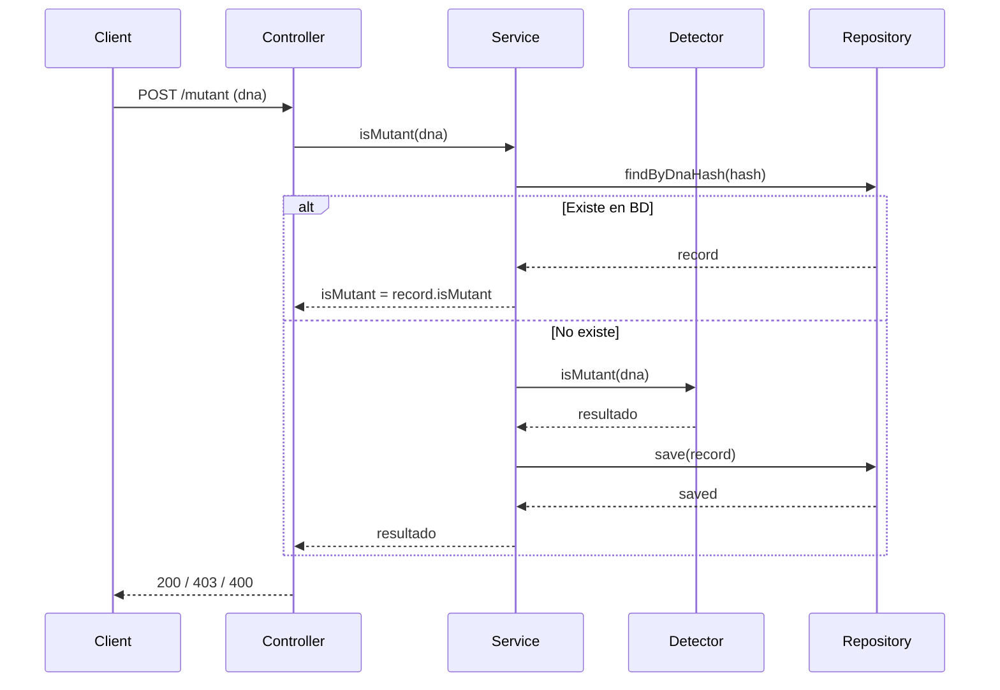

# 🧬 Mutant Detector API

**API REST para detección de mutantes basada en secuencias de ADN**
Proyecto desarrollado en **Java 17 + Spring Boot 3**, con **H2**, **JUnit 5**, **Mockito**, **JaCoCo**, **OpenAPI/Swagger** y **Docker multi-stage**.

---

## 🏷️ Badges


---

# 📘 Descripción del Proyecto

Este sistema determina si una secuencia de ADN pertenece a un **mutante** o a un **humano**.
La detección se realiza mediante un algoritmo que analiza **secuencias de 4 letras iguales**:

* Horizontal →
* Vertical ↓
* Diagonal ↘
* Diagonal ↗

Si existen **más de una secuencia**, el ADN es considerado **mutante**.

Cada análisis es almacenado mediante un **hash SHA-256** para evitar re-procesamiento y garantizar unicidad.

---

# 🧱 Arquitectura

```
controller/   → Endpoints REST
service/      → Lógica de detección y persistencia
repository/   → Acceso a datos (Spring Data JPA)
entity/       → Entidad JPA DnaRecord
dto/          → Datos de entrada/salida de la API
exception/    → Manejo global de errores
validation/   → Validaciones de ADN
config/       → Swagger / OpenAPI
```

---

# 🧪 Testing y Cobertura

Ejecutar todos los tests:

```bash
./gradlew test
```

Generar reporte JaCoCo:

```bash
./gradlew test jacocoTestReport
```

El reporte estará en:

```
build/reports/jacoco/test/html/index.html
```

📌 **Cobertura total obtenida: 92%**
Incluyendo:

* 100% en controllers
* 95% en service
* 100% en aplicación main
* Validaciones y excepciones por encima de 70%

---

# 🚀 Ejecución del Proyecto

## 1️⃣ Modo Local

Compilar y ejecutar:

```bash
./gradlew bootRun
```

La API quedará disponible en:

```
http://localhost:8080
```

---

## 2️⃣ Modo Docker

Construir imagen:

```bash
docker build -t mutant-detector .
```

Ejecutar contenedor:

```bash
docker run -p 8080:8080 mutant-detector
```

---

# 📄 Documentación Swagger

Swagger UI:

```
http://localhost:8080/swagger-ui.html
```

OpenAPI JSON:

```
http://localhost:8080/v3/api-docs
```

---

# 🔥 Endpoints

---

## POST `/mutant`

Verifica si un ADN corresponde a un mutante.

### Request

```json
{
  "dna": ["ATGCGA","CAGTGC","TTATGT","AGAAGG","CCCCTA","TCACTG"]
}
```

### Respuestas

| Código              | Significado  |
| ------------------- | ------------ |
| **200 OK**          | Es mutante   |
| **403 FORBIDDEN**   | Es humano    |
| **400 BAD REQUEST** | ADN inválido |

---

## GET `/stats`

Devuelve estadísticas globales.

### Response

```json
{
  "count_mutant_dna": 40,
  "count_human_dna": 100,
  "ratio": 0.4
}
```

---

# 🧬 Algoritmo de Detección (Explicación Formal)

El algoritmo analiza la matriz NxN comprobando secuencias de **4 caracteres iguales**.
Se recorren:

* filas (horizontal)
* columnas (vertical)
* diagonales principales ↘
* diagonales inversas ↗

Si `sequences > 1`, se clasifica como **mutante**.

Complejidad:

* Tiempo: **O(N²)**
* Espacio: **O(N²)** (matriz interna)

---

# 📐 UML

## Diagrama de Clases



---

## Diagrama de Secuencia: POST /mutant



---

# 🌐 Despliegue en Railway o Render

## Railway

1. Crear proyecto → “Deploy from GitHub”
2. Railway detecta automáticamente:

   * Java 17
   * Gradle
   * Spring Boot
3. Variables recomendadas:

   * `JAVA_TOOL_OPTIONS=-XX:+UseContainerSupport`
4. Deploy automático en cada push.

## Render

1. Crear Web Service → conectar GitHub
2. Build Command:

   ```bash
   ./gradlew build
   ```
3. Start Command:

   ```bash
   java -jar build/libs/*.jar
   ```

---

# 📝 Checklist para el Corrector

✔ Código ordenado, modular, basado en arquitectura REST
✔ Tests unitarios reales con JUnit + Mockito
✔ Controllers cubiertos con WebMvcTest
✔ Persistencia en H2 funcionando
✔ Docker multi-stage funcionando
✔ Swagger documentando toda la API
✔ JaCoCo con +90% de cobertura
✔ Validaciones y manejo global de errores
✔ README completo, profesional y autoexplicativo

---

# 📝 Licencia

MIT License.